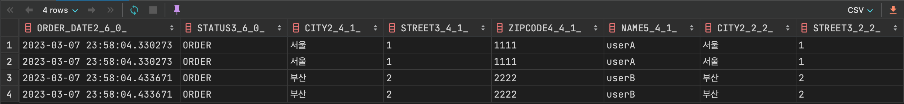
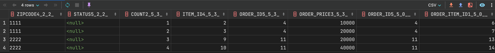
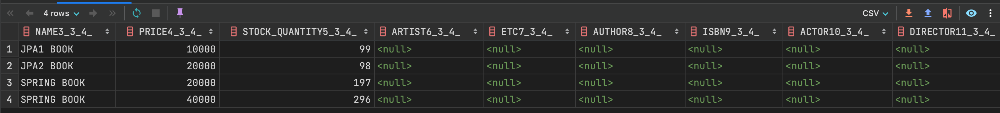

## v3
```java
public List<Order> findAllWithItem(){

        return em.createQuery(
        "select distinct o from Order o"+
        " join fetch o.member m"+
        " join fetch o.delivery d"+
        " join fetch o.orderItems oi"+
        " join fetch oi.item i",Order.class)
        .setFirstResult(1)
        .setMaxResults(100)
        .getResultList();
        }
```
이렇게 하면 모든걸 한방에 싹 다 긁어오지만 불필요한 중복데이터도 많아서 v3.1보다 무조건 좋다고 말하긴 힘듬




</br>
이게 한줄에 다 들어있는데 중복데이터가 많음(1:N 조인시 데이터수 뻥튀기)


## v3.1
### yml에 default_batch_fetch_size 적용
```java
@GetMapping("/api/v3.1/orders")
    public List<OrderDto> OrdersV3_page(@RequestParam(value="offset", defaultValue = "0") int offset,
                                        @RequestParam(value="limit", defaultValue = "100") int limit)
    {
        //List<Order> orders = orderRepository.findAllWithMemberDelivery();//페치조인으로 가져온것
        List<Order> orders = orderRepository.findAllWithMemberDelivery(offset, limit);
        List<OrderDto> result = orders.stream()
                .map(o -> new OrderDto(o))
                .collect(Collectors.toList());
        return result;
    }
```
```java
public List<Order> findAllWithMemberDelivery(int offset, int limit) {
        return em.createQuery(
                "select o from Order o"+
                        " join fetch o.member m"+
                        " join fetch o.delivery d", Order.class
        )
        .setFirstResult(offset)
        .setMaxResults(limit)
        .getResultList();

    }
```

* 쿼리문 나가는걸 보면
* sql

```sql
select item0_.item_id as item_id2_3_0_, item0_.name as name3_3_0_, item0_.price as price4_3_0_, item0_.stock_quantity 
    as stock_quantity5_3_0_, item0_.artist as artist6_3_0_, item0_.etc as etc7_3_0_, item0_.author as author8_3_0_, item0_.isbn 
    as isbn9_3_0_, item0_.actor as actor10_3_0_, item0_.director as director11_3_0_, item0_.dtype as dtype1_3_0_ from item item0_ 
    where item0_.item_id in (2, 3, 9, 10);
```
* 조인 내역중에 아이템을 한방 쿼리로 4개 다 긁어서 가져옴(마지막에 in 2,3,9,10)
* orders와 관련한 애들을, order items를 한방에 다 가져옴.
* yml에 default_batch_fetch_size : 100으로 설정 해뒀는데 만약 총 데이터 수가 1000개면 10번에 나눠서 데이터를 가져옴
* N+1이 1+1+1로 최적화됨.
* v3보다는 쿼리 횟수는 많아져도 건당 용량은 적어서 잘 사용하면 훨씬 좋을 수 있음.