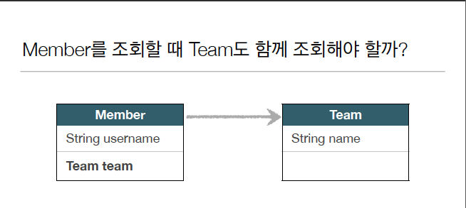
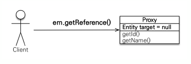
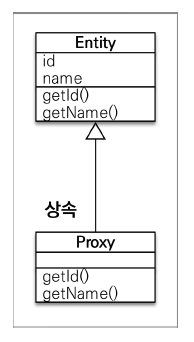
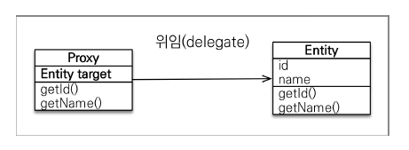
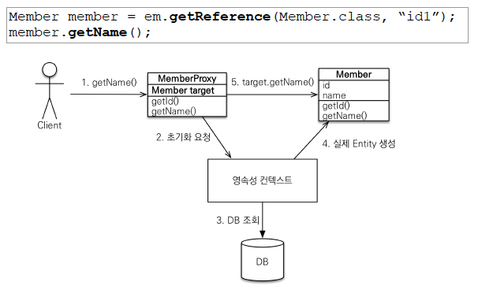

# 1. 프록시
## 1.1 프록시는 왜 써야 하는가
### 1.1.1 프록시 설명전 밑밥


* Member 조회하는데 Team도 함께 조회해야 함?
* 예를들어 member.getUsername() <- Team은 조회할 필요도 없는데 연관관계 걸렸다고 Team도 조회 해야하나? 너무 비합리적임
* 어느 경우에는 member만 가져오고 싶고 어느 경우엔 member랑 team 다 가져오고 싶음'
* -> JPA는 지연로딩이나 프록시로 해결함

### 1.1.2 em.find() vs em.getReference()

* em.find() : 데이터베이스를 통해서 실제 엔티티 객체 조회
* em.getReference() : 데이터베이스 조회를 미루는 가짜(프록시)엔티티 객체 조회
  * ->DB에 쿼리가 안나가는데 객체가 조회됨.
  ```java
  
    Member findMember = em.find(Member.class, member.getId()); -> select쿼리 나감
    Member findMember = em.getReference(Member.class, member.getId()); -> select 쿼리 안나감. 프록시 클래스라 부름
  
  ```
  

  * 하이버네이트가 자체 라이브러리를 이용해서 프록시라 부르는 가짜 객체를 던져주는거임.
  * 껍데기는 같은데 내부가 텅텅 비어있음 -> 이 가짜를 리턴받는거임

### 1.1.3 프록시 특)


* 실제 클래스를 상속받아서 만들어짐\
* 실제 클래스 모양과 겉모양이 같음
* 사용하는 입장에서는 진짜 객체인지 프록시 객체인지 구분하지 않고 사용하면 됨(이론상)




* 프록시 객체는 실제 객체의 참조(target)를 보관
* 프록시 객체를 호출하면 프록시 객체는 실제 객체의 메소드 호출

### 1.1.4 프록시 객체의 초기화


* 1 맨 처음에 getName()으로 프록시(target)를 뒤졌는데 값이 없으면
* 2 영속성 컨택스트에 진짜 값을 달라고 요청함.
* 3 그럼 영속성 컨택스트가 DB를 조회해서 진짜 값을 가져옴
* 4 진짜 엔티를 만들어냄.
* 5 타겟에다가 진짜 엔티티를 연결시켜줌
* 초기화를 통해 최초에 DB를 조회한 이후에는 Member target에 걸리기 때문에 DB를 조회하는 일은 없다.

### 1.1.5 프록시 객체 속성
* 프록시 객체는 처음 실행할 때 한번만 초기화
* 프록시 객체를 초기화 할 때, 프록시 객체가 실제 엔티티로 바뀌는건 아님. 초기화 하면 프록시 객체를 통해서 실제 엔티티에 접근이 가능.
* 프록시 객체는 원본 엔티티를 상속받음. 따라서 타입 체크시 주의해야 함(==비교 실패. 대신 instance of 사용)
* 영속성 컨택스트에 찾는 엔티티가 이미 있으면 em.getReference()를 호출해도 실제 엔티티 반환
  * 이미 1차캐시에 값이 있는데 굳이 프록시로 들고 올 이유가 없음 그냥 원본 반환하면 됨
  * 그래서 m1 = em.find(member), m2= em.getReference(member)-> m1 == m2 하면 항상 true가 나옴. jpa가 보장하는거임
  * 반대로 위에서 이미 refMem = em.getReference(member1)로 프록시로 먼저 조회한 객체를  find로 findMem = em.find(member1)로 하면 select쿼리가 날아가지 않고 findeMem도 프록시로 조회됨. DB뒤지지 않음
  * refMem== findMem을 보장해야 하므로 jpa서 그렇게 하는거임. -> 프록시든 아니든 개발에 큰 영향이 없게끔 해줌.
* 영속성 컨택스트의 도움을 받을 수 없는 준영속 상태일때 프록시를 초기화 하면 문제가 발생함
  *  ```java
     Member refMember = em.getReference(Member.class, member1.getId());
     System.out.println("refMember = "+refMember.getClass());
     
     em.detach(refMember);
     //em.clear() ->얘도 영속성 컨택스트 다 날려버리는 애니깐 프록시 이용 못한다고 뜸
     
     refMember.getUsername(); // -> 영속성 컨택스트를 통해서 요청하고 값 가져오고 연결해주고 하는건데 영속성 컨택스트에서 관리를 안해버리면 프록시를 시용할 수가 없음 -> 실무에서 자주 만날거임. 미리 알아두셈

     ```
    * Hibernate는 org.hibernate.LazyInitializationException예외를 터트림)
### 1.1.6 프록시 확인
* 프록시 인스턴스의 초기화 여부 확인
  * emf.PersistenceUnitUtil().isLoaded(Object entity)
* 프록시 클래스 확인 방법
  * eintity.getClass() .getName() 출력(..javasist.. or HibernameProxy..)
* 프록시 강제 초기화
  * org.hibernate.Hibername.initialize(entity);

* 참고 : jpa 표준은 강제 초기화 없음
  * 강제호출 : member.getName()


