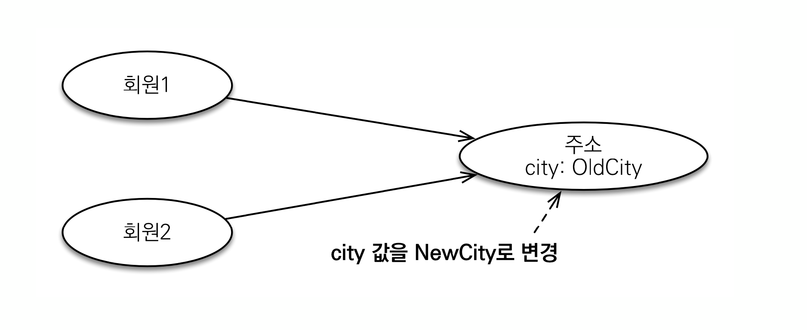

# 3. 값 타입과 불변 객체
## 3.1 갑 타입 공유 참조

* 임베디드 타입같은 값 타입을 여러 엔티티에서 공유하면 위험함
* 부작용이 발생함



예시
```java

public class JPAMain{
    public static void main(String[] args) {
        
        Address  address = new Address("city", "street", "10000");
        
        Member member1 = new Member();
        member1.setUsername("member1");
        member1.setHomeAddress(address);
        em.persist(member1);
        
        Member member2 = new Member();
        member2.setUsername("member2");
        member2.setfAddress(address);
        
        em.persist(membrer2);
        
        //
        member1.getHomeAddress().setCity("newCity"); //개발자는 member1의 주소만 바꿨다고 생각하지만 실제로는 공유하는 값을 바꿔서 member2도 값이 바뀜.
        
        tx.commit();
    }
}
```

* 대신에 값을 복사해서 사용해야 함.

 ```java

public class JPAMain{
    public static void main(String[] args) {
        
        Address  address = new Address("city", "street", "10000");
        
        Member member1 = new Member();
        member1.setUsername("member1");
        member1.setHomeAddress(address);
        em.persist(member1);
        
        Address coppyAddress = new Address(address.getCity(), address.getStreet(), address.getZipcode());// <- 값을 복사
        
        Member member2 = new Member();
        member2.setUsername("member2");
        member2.setfAddress(copyAddress); // <- 사고를 막기 위해 복사한 값을 넣어줌
        
        em.persist(membrer2);
        
        //
        member1.getHomeAddress().setCity("newCity"); //이러면 member1의 값만바뀜.
        
        tx.commit();
    }
}
```


## 3.2 객체 타입의 한계
* 항상 값을 복사해서 사용하면 공유 참조로 인해 발생하는 부작용을 피할 수 있다.
* 문제는 임베디드 타입처럼 직접 ㅅㅎ정의한 값 타입은 자바의 기본 타입이 아니라 객체 타입이다
* 자바 기본 타입에 값을 대입하면 값을 복사한다.
* 객체 타입은 참조 값을 직접 대입하는 것을 막을 방법이 없다.
* 객체의 공유 참조는 피할 수 없다.

## 3.3 불변 객체
* 객체 타입을 수정할 수 없게 만들면 부작용을 원천 차단
* 값 타입은 불변객체로(immutable object)로 설계해야 함
* 불변객체 : 생성 시점 이후 절대 값을 변경할 수 없는 객체
* 생성자로만 값을 설정하고 수정자(setter)를 만들지 않으면 됨
* 참고 : Integer, String은 자바가 제공하는 대표적인 불변객치