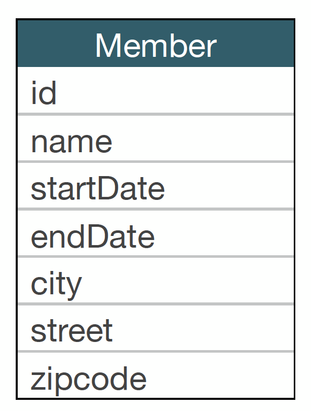
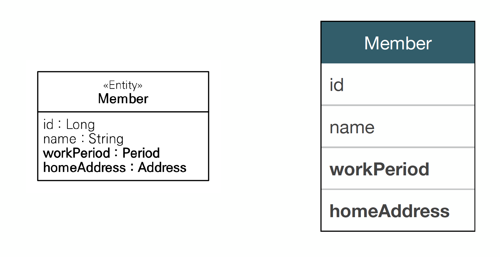
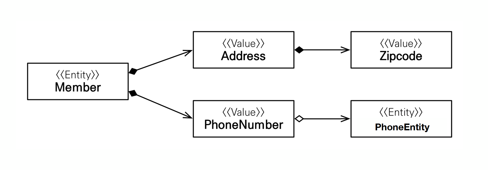

# 2. 임베디드 타입
 * 새로운 값 타입을 직접 정의 할 수 있음
 * JPA는 임베디드 타입이라 함
 * 주로 기본 값 타입을 모아서 만들어서 복합 값 타입이라고도 함
 * int, String과 같은 값 타입


## 2.1 임베디드란?
 

    * 회원 엔티티는 이름, 근무 시작일, 근무 종료일, 주소도시, 주소 번지, 주소 우편번호를 가진다.




    * 하지만 실생활에서는 이름, 근무기간, 집주소를 가진다 이렇게 공통적인건 추상화 하여 설명한다


    * 이렇게 workPeriod, homeAddress를 따로 클래스를 빼서 엔티티를 만들면 됨.

-> 이렇게 묶어낼 수 있는게 임베디드 타입이라 함.


## 2.2 임베디드 타입 사용법
* @Embeddable: 값 타입을 정의 하는 곳에 표시
* @Embedded: 값 타입을 사용하는 곳에 표시
* 기본 생성자 필수


### 2.2.1 장점
* 재사용
* 높은 응집도
* Period.isWork()처럼 해당 값 타입만 사용하는 의미있는 메소드를 만들 수 있음
* 임베디드 타입을 포함한 모든 값 타입은, 값 타입을 소유한 엔티티에 생명주기를 의존함.

## 2.3 예시

1번 Member
```java
@Entity
public class Member{
    
    @Id
    @GeneratedValue
    @Column(name = "USERNAME")
    private String username;
    
    //기간
    private LocalDateTime startDate;
    private LocalDateTime endDate;
    
    
    //주소
    private String city;
    private String street;
    private String zipcode;
}

```

이걸 기간과 주소를 따로 빼내서

2번 Member
```java
@Entity
public class Member{
    
    @Id
    @GeneratedValue
    @Column(name = "USERNAME")
    private String username;
    
    //기간
    @Embedded
    private Period workPeriod;
    
    //주소
    @Embedded
    private Address homeAddress;
   
}

```

```java
@Embeddable
public class Period{
    private LocalDateTime startDate;
    private LocalDateTime endDate;
    //getter setter + 기본 생성자
        }
```
```java
@Embeddable
public class address{
    private String city;
    private String street;
    private String zipcode;
    //getter setter + 기본생성자
}
```

* -> 실행해보면 1번 Member와 2번 Member의 테이블 차이는 없다. 

```java

public class JPAMain{
    public static void main(String[] args) {
        Member member = new Member();
        member.setUsername("hello");
        member.setHomeAddress(new Address("city, "street", "1234""));
        member.setWorkperiod(new Peroid());
        
        em.persist(membrer);
        tx.commit();
    }
}
```

## 2.4 임베디드 타입과 테이블 매핑
* 임베디드 탕비은 엔티티의 값일 뿐이다.
* 임베디드 타입을 사용하기 전과 후에 매핑하는 테이블은 같다.
* 객체와 테이블을 아주 세밀하게(find-grained) 매핑 하는것이 가능
* 잘 설계한 ORM 애플리케이션은 매핑한 테이블의 수보다 클래스의 수가 더 많음

## 2.5 임베디드 타입과 연관관계


* PhoneNumber 임베디드 타입이 PhnoneEntity 엔티티를 가질 수 있음.
* 이게 되나? 싶지만 PhoneNumber는 PhoneEntity의 fk만 들고있으면 되기 때문에 가능함.

### 2.5.1. @AttributeOverrride : 속성 재정의
* 한 엔티티에서 같은 값 타입을 사용하면?
* 컬럼명이 중복됨
* @AttributeOverrides, @AttributeOverride를 사용해서 컬러명 속성명을 재정의 해야함.
```java
@Entity
public class Member{
    
    @Id
    @GeneratedValue
    @Column(name = "USERNAME")
    private String username;
    
    //기간
    @Embedded
    private Period workPeriod;
    
    //주소
    @Embedded
    private Address homeAddress;
    
    @Embedded
    @AttributeOverrides({
            @AttributeOverride(name="city",
                Column=@Column(name="WORK_CITY")),
            @AttributdeOveriide(name="street",
                Column=@Column(name="WORKSTREET")),
            @AttributeOVerride(name="zipcode",
                Column=@Colum(name="WORK_ZIPCODE"))
            })
    private Address workAddress;// Address 타입이 중복되기 때문에 위에처럼 @AttributeOverrides를 추가해야함
    
}

```

* main에서 돌려보면 Member 테이블에 위에서 재정의한 workAddress 컬럼이 따로 추가된 것을 볼 수 있다.


### 2.5.2 임베디드 타입과 null

*임베디드 타입의 값이 null이면 매핑한 컬럼 값은 모두 null