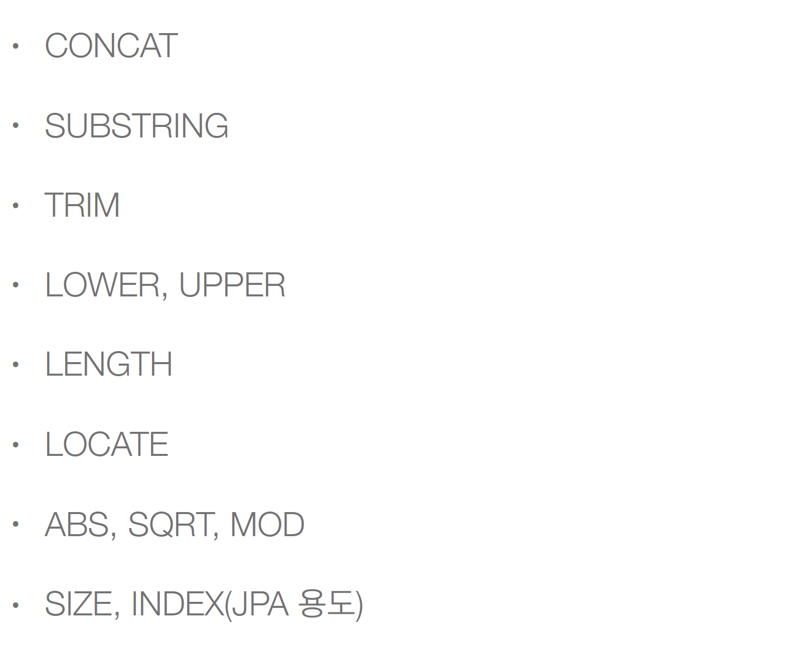

# 9 JPQL 기본 함수

## 9.1 JPQL에서 제공하는 기본함수


* 얘들은 DB 방언에 좌우되지 않음. 편하게 DB종류 가리지 않고 그냥 쓰면됨

### 9.1.1 SIZE
```java
String query = "select size(t.members) From Team t"
```
* size : 컬렉션의 크기를 알려주는 함수


## 9.2 사용자 정의 함수
* 기본함수로는 처리가 되지 않는다면 사용
* 사용하는 DB 방언을 상속받고 사용자 정의 함수를 등록한다

```java
public class MyH2Dialect extends H2Dialect{// oracle 쓰면 extends OracleDialect 쓰면 됨
    registerFunction("group_concat", new StandardSQLFunction("group_concat", StandardTypes.String));
}
```
* 먼저 클래스에 Dialect를 등록을 해둬야 사용이 가능함.
* 등록법은 외울수가 없고 H2Dialect(오라클 쓰면 OracleDialect)를 커맨드 누르고 클릭 해보면 등록법 다 나와있음 그거 보고 등록하면 됨
* 그리고 persistance.xml 가서 방언 등록을 하는데 value="dialect.MyH2Dialect" 해주면 됨

```
select function('group_concat', i.name) from Item i;
```

