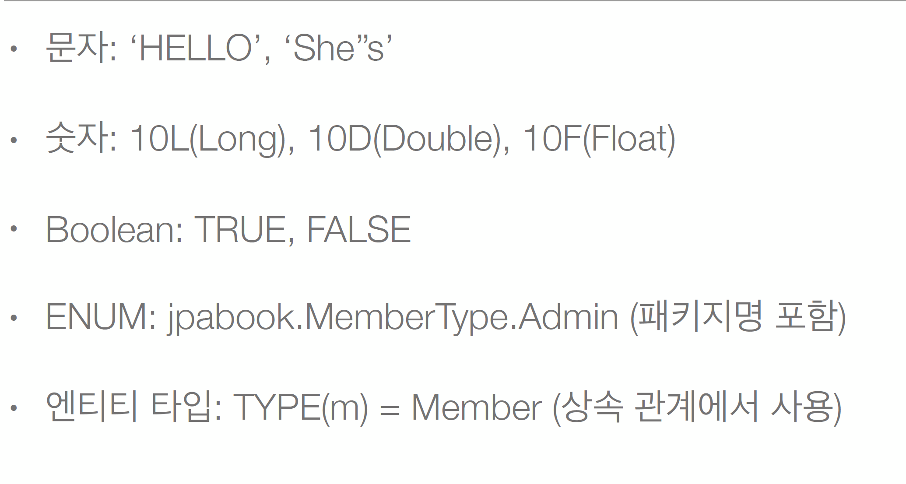
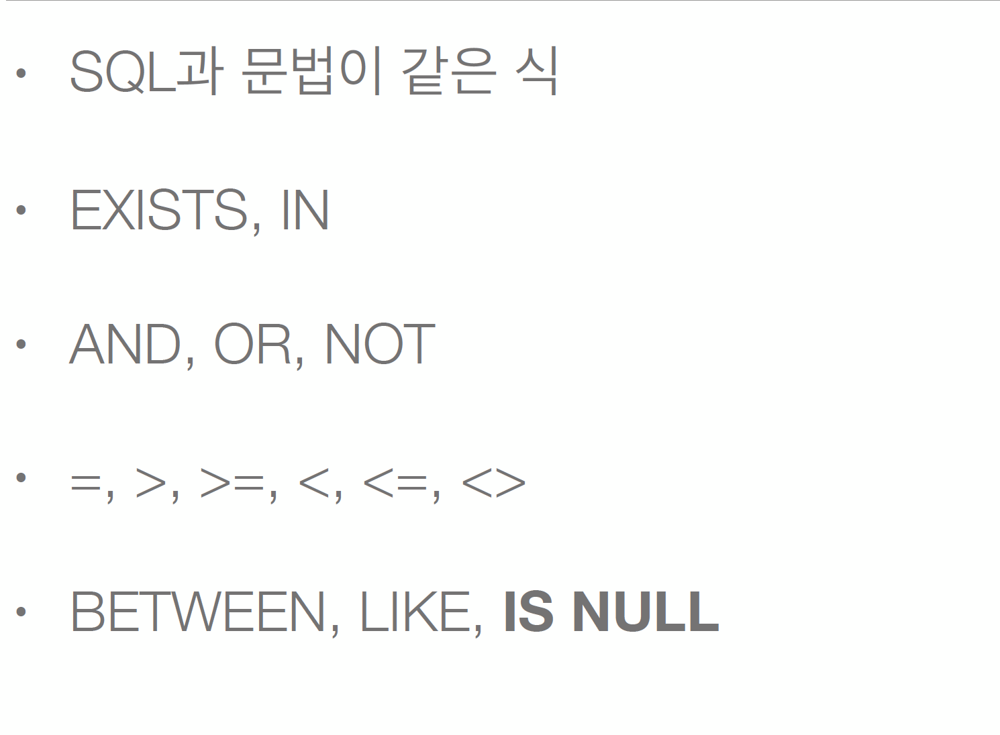

# 7 JPQL 타입 표현



```java
public class Main{
    public static void main(String[] args) {
        
        String query = "select m.username, 'HELLO', true FROM Member m"+
                "where m.type = jpql.MemberType.ADMIN";
        List<Object[]> result = em.createQuery(query)
                .getResultList();
        
        for(object[] objects:result){
            System.out.println("objects ="+ objects[0]);
            System.out.println("objects ="+ objects[1]);
            System.out.println("objects ="+ objects[2]);
        }
    }
}

```




