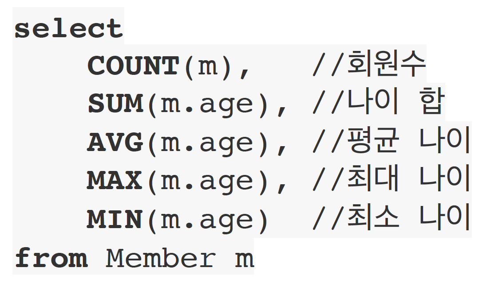

# 2. JPQL 소개

* JPQL은 객체지향 쿼리 언어다. 따라서 테이블을 대상으로 쿼리 하는것이 아니라 엔티티 객체를 대상으로 쿼리한다.
* JPQL은 SQL을 추상화해서 특정 DB SQL에 의존하지 않는다.
* JPQL은 결국 SQL로 변환된다.

## 2.1 엔티티 설계


```java
@Entity
public class Member{
    @Id
    @GeneratedValue
    private Long id;
    private String username;
    private int age;
    
    @ManyToOne
    @JoinColumn("team_id")
    private Team team;
    
    //getter setter 생성자
}

```
```java
@Entity
public class Team{
    @Id
    @GeneratedValue
    private Long id;
    private String name;
    
    @OneToMay(mappedBy="team")
    private List<Member> members = new ArrayList<>();

    //getter setter 생성자
}

```

```java
@Entity
@Table(name="ORDERS")
public class Order {
    @Id
    @GeneratedValue
    private Long id;
    private int orderAmount;

    @Embedded
    private Address address;
    
    @ManyToOne
    @JoinColmn(name="PRODUCT_ID")
    private Product product;

    //getter setter 생성자
}
```

```java
@Embeddable
public class Address{
    private String city;
    private String street;
    private String zipcode;

    //getter setter 생성자
}
```
```java
@Entity
public class Product{
    @Id
    @GeneratedValue
    private Long id;
    private String name;
    private int price;
    private int stockAmount;

    //getter setter 생성자
}
```

## 2.2 JQPL 문법


* 그냥 SQL문이랑 똑같음
* select m from Member as m where m.age > 18;
* 엔티티와 속성은 대소문자 구분O(Member, age)
* JPQL 키워드는 대소문자 구분 하지 않음(SELECT, where, FROM)
* 엔티티 이름 사용, 테이블 이름이 아님(Member)
* 별칭은 필수(Member m) (as는 생략 가능)

## 2.3 집합과 정렬



## 2.4 Query
* TypeQuery : 반환 티입이 명확할 때 사용
* Query : 반환 타입이 명확하지 않을 때 사용


```java
public class Main{
    public static void main(String[] args) {
        Member member = new Member();
        member.setUsername("member1");
        member.setAge(10);
        em.persist(member);
        
        TypedQuery<Member> query1 = em.createQuery("select m from Member m", Member.class);
        Query query2 = em.createQuery("select m.username, m.age form Member m"); // username은 String, age는 int값이라 반환값이 명확하지 않음
    }
}

```

## 2.5 결과 조회 API
* query2.getResultList(): 결과가 하나 이상일때, 리스트 반환
  * 결과가 없으면 빈 리스트 반환 -> npe 걱정 안해도 됨
* query2 .getSingleResult() : 결과가 정확히 하나, 단일 객체 반환
  * 결과가 없으면 : NPE -> try catch 써야하고 아 귀찮음. Spring Data Jpa 쓰게되면 null 반환함.
  * 둘 이상이면 : NonUniqeResultException

## 2.6 파라미터 바인딩 - 이름기준, 위치기준

```java
public class Main{
    public static void main(String[] args) {
        Member member = new Member();
        member.setUsername("member1");
        member.setAge(10);
        em.persist(member);
        
        
        Member result = em.createQuery("select m from Member m where m.username = :username", Member.class)
                .setParameter("username", "member1")// username == member1 인걸 찾아라 라는 뜻
                .getSingleResult();
        System.out.println("result="+result.getUsername());
    }
}

```

* 위치기반은 되도록 쓰지 말것 -> 중간에 다른거 끼워 넣으면 순서가 바껴서 장애남
* 이름기반은 그럴 일이 없어서 괜찮음
* 