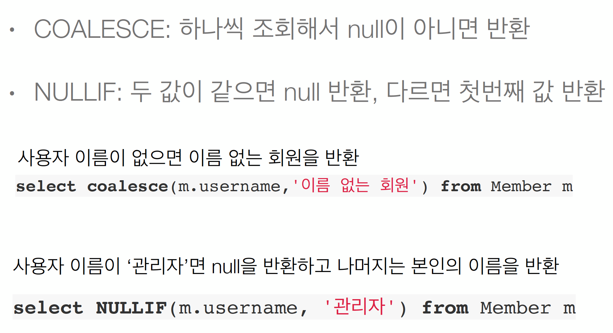

# 8 조건식(CASE)
## 8.1 기본 CASE식
```sql
select 
    case when m.age <= 10 then '학생요금'
        when m.age >= 60 then '경로요금'
        else '일반요금'
    end
from Member m
```
* 어떤 범위내에 있는 값

## 8.2 단순 CASE식
```sql
select 
    case t.name
        when  '팀A' then '인센티브110%'
        when '팀' then '인센티브120%'
        else '인센티브105%'
    end
from Team t
```
* 정확히 지정한 값

## 8.3 COALESCE, NULIF
