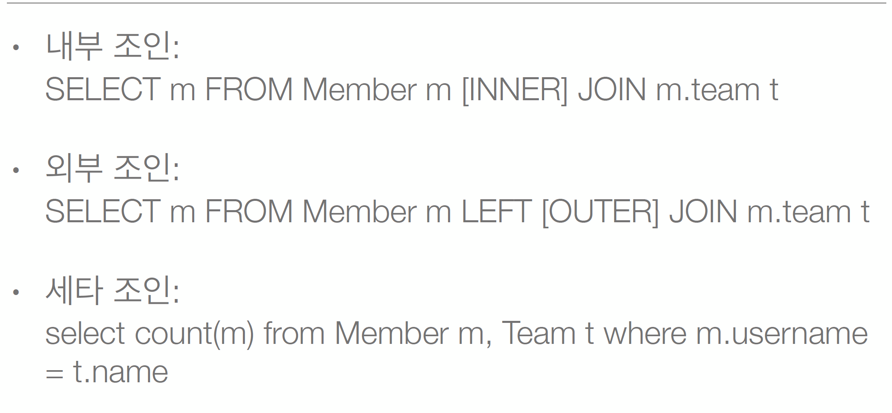

# 5. 조인
* sql의 join과 크게 다르지는 않지만
* 엔티티를 위주로 join이 됨. 객체스타일로 쿼리문이 나감



* 세타조인 : 연관관계가 없는 객체끼리 조인하는 경우.Member와 Team은 연관관계가 없는 그냥 이름이 같은 사람끼리 조인하는걸 하는것도 있잖슴

```java
@Entity
public class Member{
    @Id
    @GeneratedValue
    private Long id;
    private String username;
    private int age;
    
    @ManyToOne(fetch = FetchType.LAZY)
    @JoinColumn("TEAM_ID")
    private Team team;
    
    public void changeTeam(Team team){
        this.team = team;
        team.getMembers().add(this);
    }
    
    //getter setter 생성자
}

```


```java
@Entity
public class Team{
    @Id
    @GeneratedValue
    private Long id;
    private String name;
    
    @OneToMay(mappedBy="team")
    private List<Member> members = new ArrayList<>();

    //getter setter 생성자
}

```


```java
public class Main{
    public static void main(String[] args) {
        
        Team team = new Team();
        team.setName("teamA");
        em.persist(team);
        
        Member member = new Member();
        member.setUsername("member1");
        member.setAge(10);
        
        member.setTeam(team);
        
        em.persist(member);
        
        em.flush();
        em.clear();

        List<Member> result = em.createQuery("select m from Member m inner join m.team", Member.class)//inner join
                .setFirstResult(0)
                .setMaxREsults(10)
                .getResultList();
        
        List<Member> result = em.createQuery("select m from Member m inner join m.team t where t.name = :teamName", Member.class) // inner join 후 파리미터 받아서 같은거 찾고 그럼
                .setFirstResult(0)
                .setMaxREsults(10)
                .getResultList();
        
        List<Member> result = em.createQuery("select m from Member m left outer join m.team", Member.class)// outer join
                .setFirstResult(0)
                .setMaxREsults(10)
                .getResultList();


        List<Member> result = em.createQuery("select m from Member m, Team t where m.username = t.name", Member.class)// 세타 조인
                .setFirstResult(0)
                .setMaxREsults(10)
                .getResultList();

    }
}

```


## 5.1 Join ON 절
* ON절을 활용한 join(JPA 2.1부터 지원)
1. 조인 대상 필터리
2. 연관관계 없는 엔티티 외부 조인(하이버네이트 5.1부 )


### 5.1.1 조인 대상 필터링
* ex) 회원과 팀을 조인하면서 팀 이름이 A인 팀만 조인
* JPQL : SELECT m, t FROM Member m LEFT JOIN m.team t on t.name = 'A'
* SQL : SELECT m.*,t.*FROM Member m LEFT JOIN Team t ON m.TEAM_ID=t.id and t.name='A'

### 5.1.2 연관관계 없는 엔티티 외부 조인
* ex) 회원의 이름과 팀의 이름이 같은 대상 외부 조인
* JPQL : SELECT m, t from Member m LEFT JOIN Team t on m.username = t.name
* SQL : SELECT m.*, t.* FROM Member m LEFT JOIN Team t ON m.username = t.name

