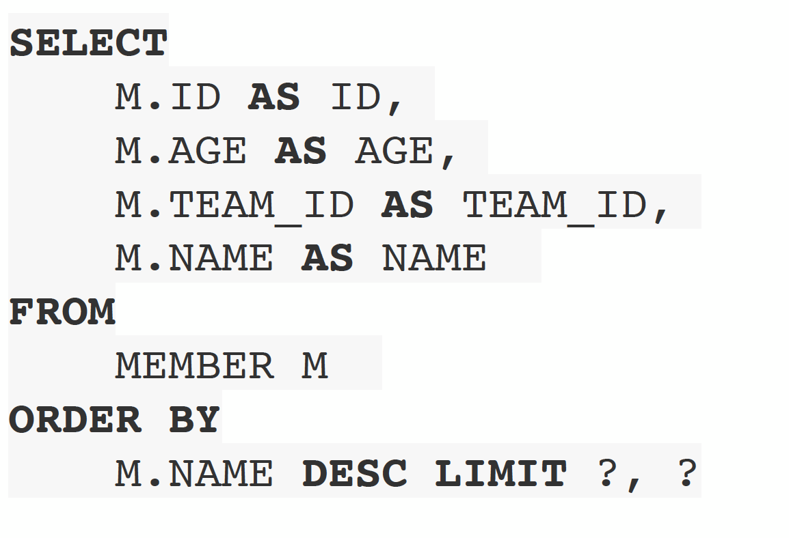
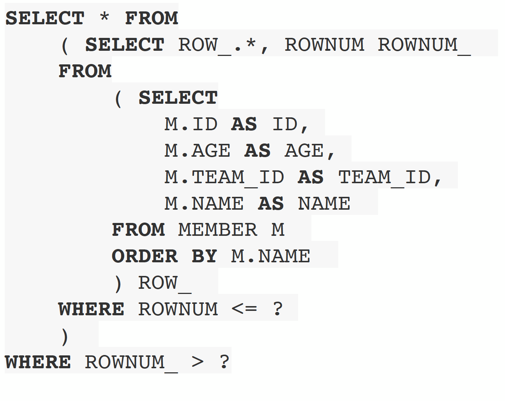

# 4. 페이징 API
* jpa는 페이징을 다음 두 api로 추상화
* setFirstResult(int startPosition): 조회 시작 위치(0부터 시작)
* setMaxResults(int maxResult): 조회할 데이터 수

```java
public class Main{
    public static void main(String[] args) {
        List<Member> result = em.createQuery("select m from Member m order by m.age desc", Member.class)
                .setFirstResult(0)
                .setMaxREsults(10)
                .getResultList();

        System.out.println("result.size = "+result.size());
        for (Member member1 : result){
            System.out.println("member1="+member1);
        }
    }
}

```
* MySql 방언
 <br>


* Oralce 방언



