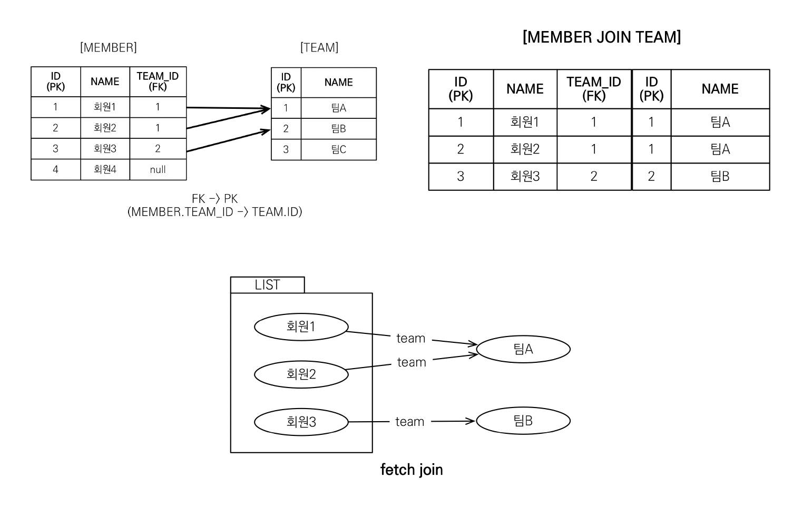
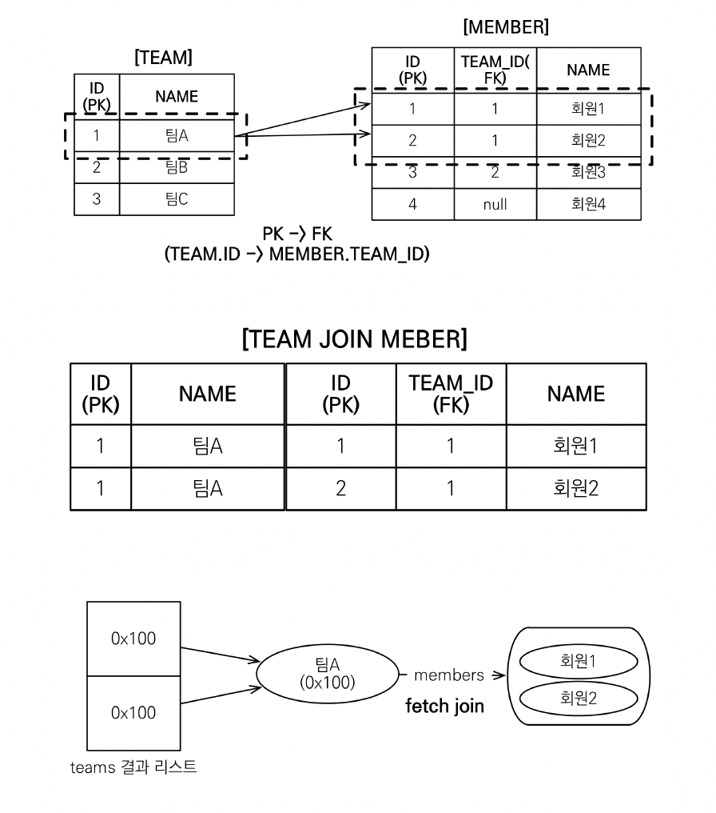
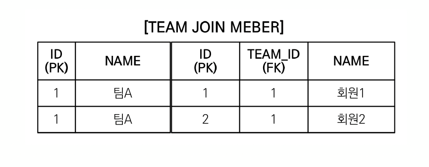
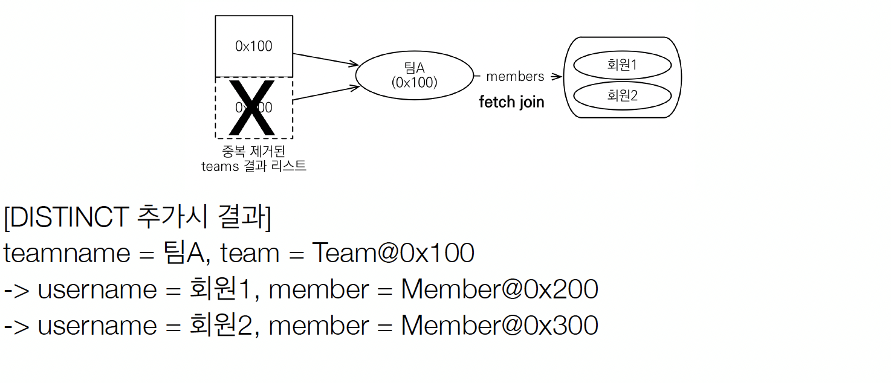

# 2. Fetch Join.
## 실무에서 엄청나게 중요함

## 2.1 fetch join이란?
* SQL join의 종류가 아님
* JPQL에서 성능 최적화를 위해 제공하는 기능
* 연관된 엔티티나 컬렉션을 SQL 한번에 함께 조회하는 기능
* join fetch 명령어 사용
* 피치 조인 ::=[LEFT[outer]|INNER] JOIN FETCH

## 2.2 엔티티 페치 조인
* 회원을 조회하면서 연관된 팀도 함께 조회(SQL 한번에)
* SQL을 보면 회원 뿐만 아니라 팀(T.*)도 함께 select
```sql
JPQL
selct m from Member m  fetch m.team
```
```sql
SELECT M.*, T.* FROM Member M 
INNER JOIN TEAM T ON M.TEAM_ID=>ID
```
*  다른건 없고 jqpl문에서 join 뒤에 fetch만 넣어주면 됨.
* jpql문 날릴땐 m만 적었는데 sql문은 Member와 Team의 모든 정보를 다 가져옴
* 어디서 본거같은데? -> 즉시로딩이랑 상황이 같음. 근데 내가 가져올 정보를 직접 명시하는 방법

## 2.3 예제


```java
public class Main{
    public static void main(String[]args){
        
        Team teamA = new Team();
        teamA.setName("팀A");
        em.persist(teamA);

        Team teamB = new Team();
        teamA.setName("팀B");
        em.persist(teamB);

        Team teamC = new Team();
        teamA.setName("팀C");
        em.persist(teamB);
        
        
        Member member1 = new Member();
        member1.setUsername("회원1");
        em.persist(member1);
        
        Member member2 = new Member();
        member1.setUsername("회원2");
        em.persist(member2);
        
        Member member3 = new Member();
        member1.setUsername("회원3");
        em.persist(member3);
        
        
        em.flush();
        em.clear();
        
        String query = "select m From Member m";
        
        List<Member> result = em.createQuery(query, Member.class)
                        .getResultList();
        
        for(Member member : result){
            System.out.println("member = "+ member.getUsername() + ", "+member.getTeam().name());
        }
        tx.commit();
    }
}
```

* 회원1, 팀A(sql) -> 반복문을 1회차 돌 때 member.getUsername()으로 이름 가져오고 연관관계라 member.getTeam().name()을 만나면
  프록시로 가져옴. 1차캐시(영속성 컨택스트)에 팀A는 없어서 DB에서 가져옴 -> select문이 실행됨
* 회원2. 팀A -> 영속성 컨택스트에 팀A는 있어서 그냥 1차캐쉬에서 가져움 -> sql문이 날아가지 않음
* 회원3. 팀B(sql) -> 1차캐시에 팀B는 없어서 select 쿼리로 다시 가져와야함
  -> N+1문제가 발생함. 패치조인이 거의 유일

```java
String query = "select m From Member m join fetch m.team" ;
        
        List<Member> result = em.createQuery(query, Member.class)
                        .getResultList();
        
        for(Member member : result){
            System.out.println("member = "+ member.getUsername() + ", "+member.getTeam().name());
        
```
* 이렇게 패치조인을 해주면 여기서의 member.getTeam().Name();은 더이상 프록시가 아님. 패치조인으로 한방에 다 정보를 가져왔기 때문에 1차캐쉬에서 가져옴
* sql문 한방으로 더의상의 select문이 나가지 않음.
* 엔티티에서 지연로딩 설정을 해줘도 패치조인이 항상 우선임. 걱정 ㄴ


## 2.4 컬렉션 페치 조인
* 일대다 관계 컬렉션 페치 조인
```jpal
[jpql]
select t
from Team t join retch t.members
where t.anem = '팀A'
```
```sql
SELECT T.*, M.*
FROM TEAM T INNER JOIN MEMBER M ON T.ID = M.TEAM_ID
WHERE T.NAME = '팀A'
```

* 예제
```java
String query = "select t From Team t join fetch t.members" ;
        
        List<Member> result = em.createQuery(query, Team.class)
                        .getResultList();
        
        for(Team team : result){
            System.out.println("team = "+ team.getName() + "|members="+team.getMembers().size());
        
```
* 근데 출력된 결과가
```sql
team = 팀A|members=2
team = 팀A|members=2
team = 팀B|members=1
```
정보는 맞는데 팀A는 왜 두번 출력됨?-> 컬렉션에선 이걸 조심해야 함
* DB입장에선 1:N조인하면 데이터가 뻥튀기됨
* 팀 입장에선 팀A는 하난데, 맴버가 두명이라서 join결과는 행이 두개가 되는거임



* 조회한 컬렉션에는 같은 주소값을 가지는 결과가 두개 담기게 되는것

## 2.5 DISTINCT
* 2.3에서 처럼 결과 두줄 나오는게 싫어. 중복을 피하고싶어 -> 그럴 때 사용
* SQL의 DISTINCT는 중복된 결과를 제겨하는 명령
* JPQL의 DISTINCT는 두가지 기능을 제공함
    1. sql에 distinct를 추가
    2. 애플리케이션에서 엔티티 중복 제거
```sql
String query = "select distinct t From Team t join fetch t.members where t.name = '팀A' ;
```
* System.out.println(List.size())를 하면 그래도 두개나옴-> 완전히 똑같아야 DISTINCT가 됨.


회원명도 다르고 id도 두개가 다르기 때문에 SQL 입장에선 DISTINCT를 적용해도 두줄이 나옴

하지만 JPA를 통해서 보면
```java
String query = "select distinct t From Team t join fetch t.members" ;
        
        List<Member> result = em.createQuery(query, Team.class)
                        .getResultList();
        
        for(Team team : result){
            System.out.println("team = "+ team.getName() + "|members="+team.getMembers().size());
        
```
* DISTINCT가 주가로 애플리케이션에서 중복 제거 시도
* 같은 식별자를 가진 Team엔티티를 제거함




* 참고로 1:N관계는 뻥튀기가 발생하는데 N:1은 뻥튀기 발생 안됨

## 2.6 페치조인과 일반 조인의 차이
* 일반 조인 실행시 연관된 엔티티를 함께 조회하지 않음
* JPQL은 결과를 반환할 때 연관관계 고려 x
* 단지 SELECT 절에 지정한 엔티티만 조회 할 뿐
* 여기서는 팀 엔티티만 조회하고, 회원 엔티티는 조회 x
* 페치 조인을 사용 할 때만 연관된 엔티티도 함께 조회(즉시로딩)
* 페치 조인은 객체 그래프를 SQL한번에 조회하는 개념
