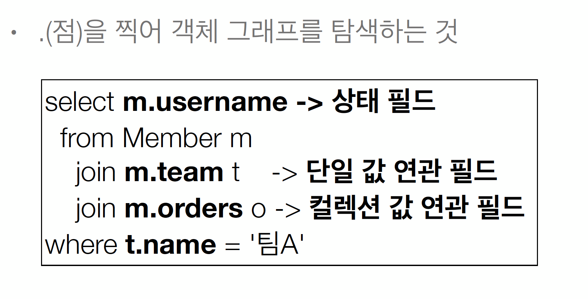

# 1 경로 표현식


## 1.1 경로 표현식 용어 정리
* 상태필드(state field): 단순히 값을 저장하기 위한 필드(ex : m.username)
* 연관필드(association field): 연관관계를 위한 필드
  * 단일 값 연관 필드: @ManyToOne, @OneToOne, 대상이 엔티티(ex : m.team)
  * 컬렉션 값 연관 필드 : @OneToMany, @ManyToMany, 대상이 컬렉션(ex : m.orders)

## 1.2 경로 표현식 특징
* 상태필드 : 경로 탐색의 끝, 탐색X
* 단일값 연관 경로 : 묵시적 내부조인 발생. 탐색O
* 컬렉션 값 연관 경로 : 묵시적 내부 조인 발생. 탐색x t.members가 끝임 t.members.username이렇게 컬렉션에서는 .더 찍어버리면 안됨.
  * FROM절에서 명시적 조인을 통해 별칭을 얻으면 벌칭을 통해 탐색 가능

* 묵시적 내부조인이 되는 방법은 될 수 있으면 피해라 -> 성능 튜닝하기 매우 힘듦.

## 1.3 실무에서는 그냥 명시적 조인을 하면 됨. 1.2절은 무시
* 묵시적 조인은 조인이 일어나는 상황을 한눈에 파악하기 어려움
```java
String query = "select m.username From Team t join t.members m";
```

## 1.4 예제
```java
select o.member.team from Order o  -> 성공
```
```java
select t.members from Team -> 성공
```
```java
select t.members.username from Team t -> 실패. 컬렉션은 t.members까지가 마지노선. 컬랙션의 그 이상은 조회 실패함. 
        t.members에서 끝내고 별칭 t를 주고 t.xxx로 들어가함
```
```java
select m.username from Team t join t.members m -> 성공 명시적 join은 가능. m에서 처음부터 다시 시작한거임
```