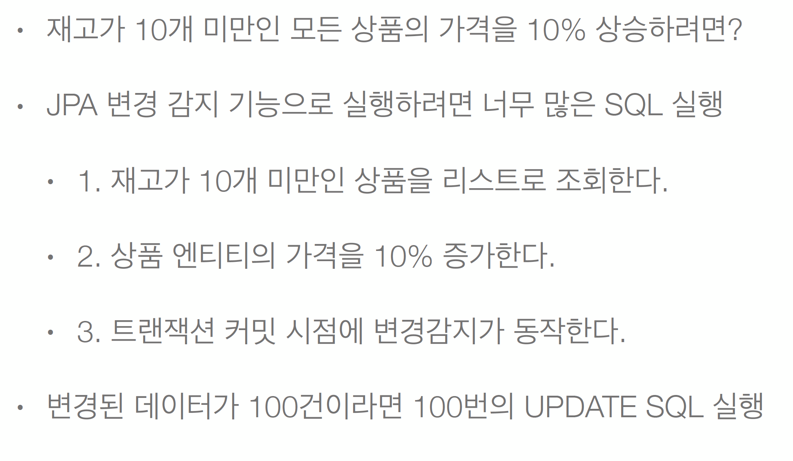
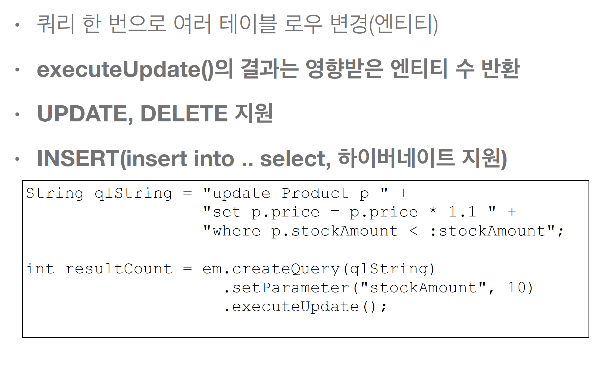

# 7.벌크연산

* 일반적으로 update, delete문 중 해당 컬럼 아이디를 딱 찍어서 하나만 실행하는게 아닌 그 외 나머지 모든걸 벌크연산이라고 함
* 예제

* JPA특성상 벌크보다는 실시간 단건 처리에 특화되어있긴 함
* 근데 벌크를 지원 안할순 없어서 다 방법을 제공하긴 함

## 7.1 주의사항
* 벌크 연산은 영속성 컨텍스트를 무시하고 데에터베이스에 직접 쿼리
* 문제를 안생기게 하는 방법 두가지가 있는데
  * 벌크연산을 먼저 실행
  * 벌크 연산 수행 후 영속성 컨텍스트 초기화 -> 위에서 쓴 member1은  그대로 쓰면 안되고 1차캐시 싹다 날리고 다시 find로 불러와야 함.
