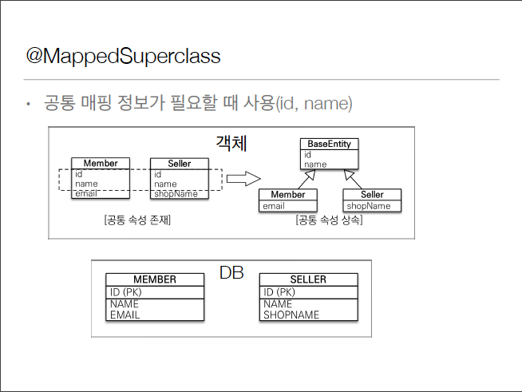

# @MappedSuperclass



* 공통 매핑 정보가 필요할 때 사용(id, name)
* 진짜 단순하게 객체 입장에서 속성만 상속받아서 사용하고 싶을때 사용
* 테이블은 서로 완전히 다른데
* Member에도 id, name이 있고 Seller도 id, name이 있으니깐
* id, name은 객체 하나에서 다 관리하고 나머지 다른 요소만 다른객체에서 보관하자를 하고싶을 때 사용'
* 귀찮을때 사용함
 
## 1. 예시 상황
* DBA 정책상 '모든' 테이블에 db작업하면 추가자, 추가 날짜, 수정한 사람, 수정 날짜, 수정내역 이런게 있어야 한다고 가정
* 모든 테이블에 복붙하기는 좀 거시기함
* 속성만 상속받아서 쓰고 싶은데.... -> @MappedSuperclass

우선 BaseEntity 생성
```java
    @Entity
    @MappedSuperclass
    public abstract class BaseEntity{
    
    @Column(name = "INSERT_MEMBER")
    private String createdBy;
    private LocalDateTime createdDate;
    
    @Column(name = "UPDATE_MEMBER")
    private String lastModifiedBy;
    private LocalDateTime lastModifiedDate;
    
    //getter setter
}
```
나머지 엔티티에
```java
    @Entity
    public class Member extends BaseEntity{
        ///
    }

    @Entity
    public class Team extends BaseEntity{
    ///
    } 
```

실행환경에서
```java
public class Main{
    Member member = new Member();
    member.setUsername("user");
    member.setCreatedBy("Kim");
    member.setCreatedDate(LocalDateTime.now());
    
    em.persist(member);
    
    em.flush();
    em.clear();
    
}
```
-> 결론은 상속관계 그런게 아니라 속성만 같이 쓰고싶어! 그런거임
* 테이블 보면 온 테이블에 @MappedSuperclass 속성이 다 들어있음

## 정리
* 상속관계 아님
* 엔티티 아님, 테이블과 매핑하는것도 아님
* 부모 클래스를 상속받는 사식 클래스에 매핑 정보만 제고
* 조회, 검색 불가(em.find(BaseEntity)가 불가능함)
* 직접 생성해서 사용할 일이 없으므로 추상 클래스 권장
* 테이블과 관계 없고, 단순히 엔티티가 공통으로 사용하는 매핑 정보를 모으는 역할
* 주로 등록일, 수정일, 등록자, 수정자 같은 전체 엔티티에서 공통으로 적용하는 정보를 모을 때 사용
* 참고: @뚜샤쇼 클래스는 엔티티나 @MappedSuperclass로 지정한 클래스만 상속 가능