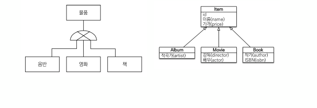
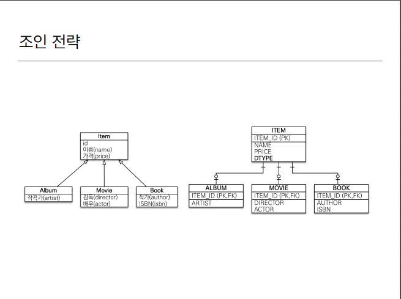
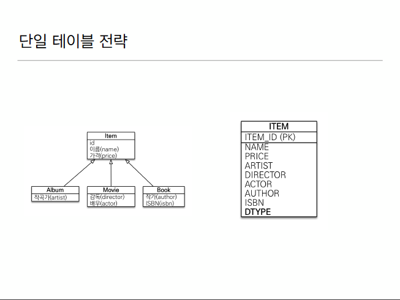
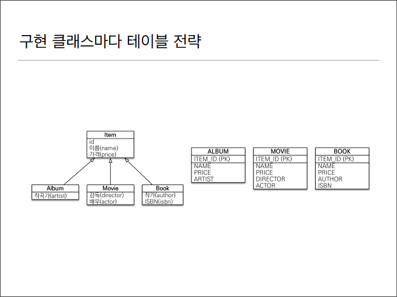

# 1. 상속관계 매핑


* RDB는 상속관계가 없음
* 슈퍼타입 서브타입 관계라는 모델링 기법이 객체 상속과 유사
* 상속관계 매핑 : 객체의 상속과 구조와 DB의 슈퍼타입 서브타입 관계를 매핑

# 2. 상속관계 구현 방법
## 2.1슈퍼타입 서브타입 논리 모델을 실제 물리 모델로 구현하는 방법
* \1. 각각 테이블로 변환 -> 조인전략
* \2. 통합 테이블로 변환 -> 단일 테이블 전략
* \3. 서브타입 테이블로 변환 -> 구현 클래스마다 테이블 전략

### 2.1.1 조인 전략


* Item table에는 이름 가격이 들어가고 아티스트, 앨범설명같은건 앨범테이블에 저장함. ITEM의 PK를 ALBUM의 FK로 가지고 있음
* 두 테이블을 조인해서 정보 가져옴. -> 테이블에 insert해야 해서 insert쿼리 두번 날아감.
* 최상위 테이블(ITEM)에 보통 구분컬럼(여기선 DTYPE)을 둠.

    ```java
    @Entity
    @Inheritance(strategy = InheritanceType.JOINED) // 이거 안걸어주면 그냥 한테이블에 다 때려박는 단일 전략으로 매핑함
    @DiscriminatorColum//이걸 넣어주면 DTYPE 컬럼이 자동으로 생김. 이거 안넣어주면 다른 테이블이랑 조인했을때 이 테이블이 왜 조인됐는지 사람이 알아보기가 힘듦.
  //name=""로 해주면 다른 이름으로 줄 수도 있음. 
    public class Item{ 
        @Id @GeneratedValue
        private Long id;
        
        private String name;
        private int price;
    }
    ```
    ```java
    @Entity
    //@DiscriminatorValue(name= "A") => DBA 정책상 ALBUM은 A, MOVIE는 M이런식으로 줘야 할 때  이 어노테이션 붙여주면 이름 다르게 해서 매핑 가능 -> DTYPE이 A로 들어가는거 확인 가능
    public class Album extends Item{
    private String artist;
    }
    
    ```
  ```java
  @Entity
  public class Movie extends Item{
    private String director;
    private String actor; 
  }
  ```
  ```java
  @Entity
  public class Book extends Item{
    private String author;
    private String isbn;
  }

  ```
  ```java
    public class Main{
    public static void main(String[] args){
      try{
        Movie movie = new Movie();
        movie.setDirector("aaaa");
        movie.setActor("bbbb");
        movie.setName("Avatar");
        movie.setPrice(10000);
  
        em.flush();
        em.clear();
  
        Movie findMovie = em.find(Movie.class, movie.getId());
        System.out.println(findMovie);
  // -> inner join으로 Item과 Movie를 조인해서 값을 가져옴
        } 
    }  
  }
  ```


####  장단점
* 장점
  * 가장 정석적 
  * 테이블 정규화
  * 외래키 참조 무결성 제약조건 활용가능
  * 저장공간 효율화

* 단점
  * 조회시 조인을 많이 사용하여 성능 저하 우려 -> 조인도 조율 잘 하면 성능 잘 나옴.
  * 조회 쿼리가 복잡함
  * 데이터 저장시 INSERT쿼리 두번 호출 -> 그렇다고 생각보다 큰 단점은 아님

### 2.1.2 단일 테이블 전략


* 한테이블에 다 때려박는 전략
* 아이템 카테고리가 앨범인지 책인지 영화인지는 DTYPE으로 구분함.

```java
    @Entity
    @Inheritance(strategy = InheritanceType.SINGLE_TABLE) 
    //@DiscriminatorColum <- 단일테이블 전략에서는 얘 안걸어줘도 DTYPE이 알아서 생김
    // 생길 수 밖에 없는게 단일에서는 null이 허용되기 때문에 DTYPE이 없으면 얘가 앨범인지 책인지 뭔지 구별이 안됨. 그래서 자동으로 생성함.
    public class Item{
        @Id @GeneratedValue
        private Long id;
        
        private String name;
        private int price;
    }
    ```
    ```java
    @Entity
    //@DiscriminatorValue(name= "A") => DBA 정책상 ALBUM은 A, MOVIE는 M이런식으로 줘야 할 때  이 어노테이션 붙여주면 이름 다르게 해서 매핑 가능 -> DTYPE이 A로 들어가는거 확인 가능
    public class Album extends Item{
    private String artist;
    }
    
    ```
  ```java
  @Entity
  public class Movie extends Item{
    private String director;
    private String actor; 
  }
  ```
  ```java
  @Entity
  public class Book extends Item{
    private String author;
    private String isbn;
  }

  ```
  ```java
    public class Main{
    public static void main(String[] args){
      try{
        Movie movie = new Movie();
        movie.setDirector("aaaa");
        movie.setActor("bbbb");
        movie.setName("Avatar");
        movie.setPrice(10000);
  
        em.flush();
        em.clear();
  
        Movie findMovie = em.find(Movie.class, movie.getId());
        System.out.println(findMovie);
  // -> join 없이 심플한 쿼리 나감. 
        } 
    }  
  }
  ```


#### 장단점
* 장점
  * 조인이 필요 없으므로 일반적으로 조회 성능이 빠름
  * 조회 쿼리가 단순함
* 단점
  * 자식 엔티티가 매핑한 컬럼은 모두 null 허용 -> 데이터 무결성 입장에서 보면 애매해짐
  * 단일 테이블에 모든 것을 저장하므로 테이블이 커질 수 있다. 상황이 따라 조회 성능이 느려질 수 있다.


### 2.1.3 구현 클래스마다 테이블 전략


* 아이템 자체 각각을 하나의 테이블로 다 가지고 있는것.
* DB설계자와 ORM 전문가 둘 다 추천 x
* 그냥 쓰면 안되는 전략.

```java
    @Entity
    @Inheritance(strategy = InheritanceType.TABLE_PER_CLASS) 
    //@DiscriminatorColum <- 각자 전부 테이블이 있는데 join 할 일도 없고 있는게 의미가 없음
    public abstract class Item{ // -> ITEM혼자서 단독으로 쓸 일이 없어서 추상으로 만들어줌
        @Id @GeneratedValue
        private Long id;
        
        private String name;
        private int price;
    }
    ```
    ```java
    @Entity
    //@DiscriminatorValue(name= "ㅁ") => DBA 정책상 ALBUM은 A, MOVIE는 M이런식으로 줘야 할 때  이 어노테이션 붙여주면 이름 다르게 해서 매핑 가능 -> DTYPE이 A로 들어가는거 확인 가능
    public class Album extends Item{
    private String artist;
    }
    
    ```
  ```java
  @Entity
  public class Movie extends Item{
    private String director;
    private String actor; 
  }
  ```
  ```java
  @Entity
  public class Book extends Item{
    private String author;
    private String isbn;
  }

  ```
  ```java
    public class Main{
    public static void main(String[] args){
      try{
        Movie movie = new Movie();
        movie.setDirector("aaaa");
        movie.setActor("bbbb");
        movie.setName("Avatar");
        movie.setPrice(10000);
  
        em.flush();
        em.clear();
  
        Movie findMovie = em.find(Movie.class, movie.getId());
        System.out.println(findMovie);
  // -> inner join으로 Item과 Movie를 조인해서 값을 가져옴
        } 
    }  
  }
  ```

#### 장단점
* 장점
  * 서브 타입을 명확하게 구분해서 처리 할 때 효과적
  * not null 제약조건 사용 가능
* 단점
  * 여러 자식 테이블을 함께 조회 할 때 성능이 느림(UNION SQL 필요) -> 테이블 전부 다 찔러봐야 해서 성능이 안좋음.
  * 자식 테이블을 통합해서 쿼리하기 어려움
 


