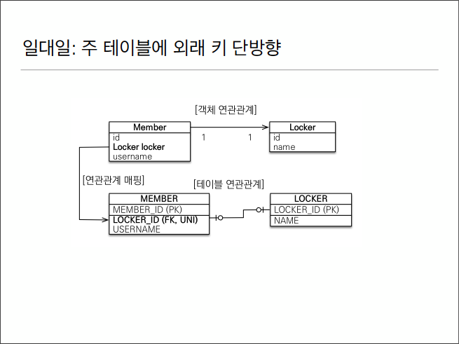
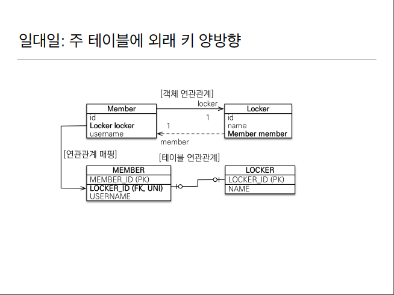
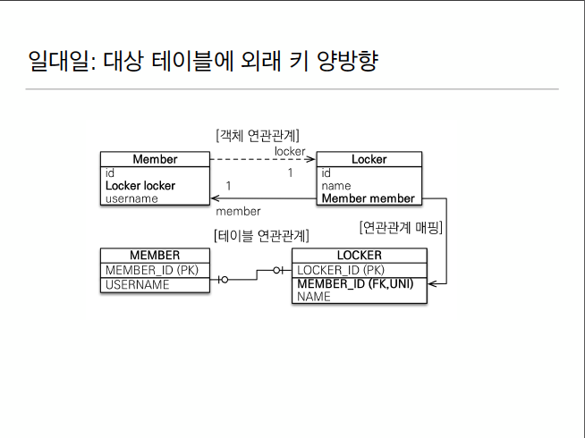
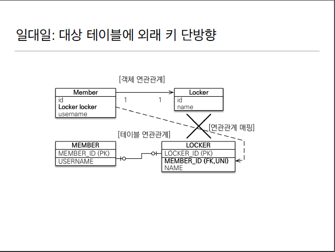

# 1.1 1:1관계
* 1대1 관계는 역으로도 1:1관계
* 주 테이블이나 대상 테이블 중에 외래키 선택가능
  * 주 테이블에 외래키
  * 대상 테이블에 외래키
* 외래키에 데이터베이스 유니크 제약조건 추가되어야 1:1관계임



## 1.2 1:1 주 테이블에 외래키 단방향 
* Member테이블에 LOCKER_ID(FK,UNI)를 넣어도 되고 LOCKER에 LOCKER_ID(PK,NUI) 넣어줘도 됨
 * 다대일 단방향과 비슷함.
  ```java
    
    @Entity
    public class Locker{
        @Id @GeneratedValue
        private Long id;
        
        private String name;
        
        @OneToOne(mappedBy = "locker")
        private Member member;
        
}
  ```
  ```java
  public class Member{
    
    @OneToOne
    @JoinColumn(name = "LOCKER_ID")
    private Locker locker;
}

  ```

## 1.3 일대일 주 테이블에 외래키 양방향


* 다대일 양방향 매핑처럼 외래 키가 있는 곳이 연관관계의 주인
* 반대편은 mappedBy로 묶어줌
* 사실상 일대일 주 테이블에 외래키 양방향 매핑 방법은 같음
### 내꺼는 내가 관리한다 -> 내 엔티티에 들어있는 외래키는 내가 직접 관리한다.


## 1.4 대상 테이블에 외래키 양방향


* 대상 테이블인 LOCKER에 fk가 있음 
* 일대일 주 테이블에 외래키 양방향을 그냥 뒤집은 꼴임
* Member_ID만 LOCKER로 넘언간거임.


## 1.5 대상 테이블에 외래키 단방향

* JPA에서 지원안함
* 양방향 관계만 지원


## 2. 그럼 fk는 누가 들고 있어야 함?


* 사실 Member나 Locker나 둘 중 누가 들고있어도 크게 상관은 없음\
* 만약 시간이 흘러서 둘중에 누가맞냐를 보면 DB입장에선 시간이 흘러서 정책이 바뀌어서 한명의 회원이 여러개의 라커를 가질 수 있다고 가정
  * 2.2의 테이블 기준으로는 Locker의 UNI만 지우면 테이블 안바꿔도 됨.
  * 1.1의 테이블 기준에서는 Member의 Locker_ID컬럼에서 UNI지우고 LOCKER 테이블 변경해야함
* 개발자 입장에선 Member가 갖고있는게 여로모로 유리함
* 경험상 Locker보다는 Member가 조회되는 숫자가 많음. Member하나만 조회해도  MEMBER에서 이미 LOCKER_ID를 갖고 있어서 LOCKER를 조인한 효과를 얻을 수 있기 때문.
* 너무 먼 미래는 생각하지 않고 많이 조회하는 MEMBER에 fk를 갖는걸 추천.
* 


## 일대일 정리
  ### 주 테이블에 외래 키
  * 주 객체가 대상 객체의 참조를 가지는 것 처럼 주 테이블에 외래 키를 두고 대상 테이블을 찾음
  * 객체지향 개발자 선호
  * JPA매핑 편리
    * 장점 : 주 테이블만 조회해도 대상 테이블에 데이터가 있는지 확인가능
    * 단점 : 값이 없으면 외래키에 null 허용
  ### 대상 테이블에 외래키

* 대상 테이블에 외래키가 존재
* 전통적인 데이터베이스 개발자 선호
* 장점 : 주 테이블과 대상 테이블을 일대일에서 일대다 관계로 변경할 때 테이블 구조 유지
* 단점 : 프록시 기능의 한계로 지연 로딩으로 설정해도 항상 즉시 로딩됨(프록시는 뒤에서 설명)


