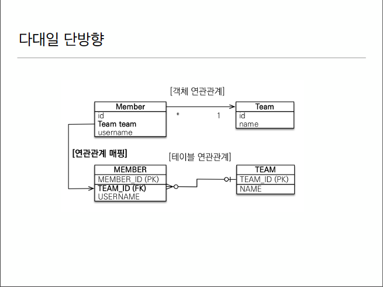
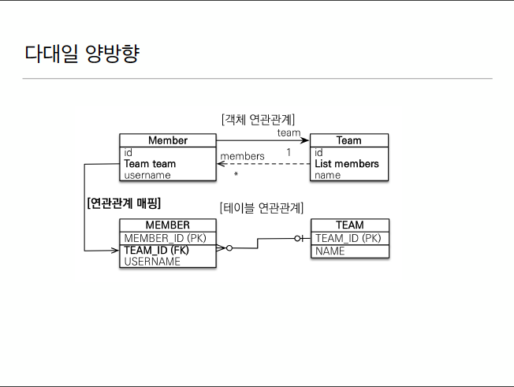

# 1. 다대일[N:1]



## 1.1 단방향
* RDB는 항상 N에 fk가 가야함.
* Member 테이블 관점에서는 팀의 id값을 찾아가려고 매핑한거임. 
* Team 객체에다가 매핑걸고 찾아가면 됨.
* 젤 많이 씀 
    ```java
    @Entity
    public class Member{
        @ManyToOne
        @JoinColumn(name = "TEAM_ID")
        private Team team;
    }
    ```
    N에만 ManyToOne을 걸어주면 됨. 1에서는 N으로 가려는 의지가 없음.

## 1.2 양방향

 
* 항상 연관관계의 주인은 N이다.
* N에 fk를 줘야함.
 ```java
    @Entity
    public class Member{
        @ManyToOne
        @JoinColumn(name = "TEAM_ID")
        private Team team;
    }
 ```
 ```java
    @Entity
    public class Team{
        @OneToMany(mappedby = "team")
        private Team team;
    }
```
* 1.1에서와 다르게 양방향은 끝에도 mappedby로 걸어줘야 함.
* mappedby는 조회는해도 쓰기, 수정, 삭제는 안됨.
* 쓰기, 수정같은걸 하고싶다면 N으로 가서(연관관계의 주인)으로 가서 해야함.
 


