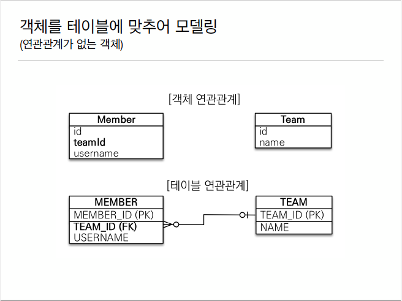

# 1. 객체를 테이블에 맞추어 모델링


## 1.1 Entity 설계 그림의 테이블 연관관계대로 설계
### 1.1.1 Member

```java
@Entity
public class Member {
    @Id
    @GneratedValue
    @Column(name="MEMBER_ID")
    private Long id;

    @Column(name = "USERNAME")
    private String username;

    @Column(name = "TEAM_ID")
    private Long teamId;//
}
```
### 1.1.2 Team
```java
@Entity
public class Team{
    @Id
    @GeneratedValue
    @Column(name = "TEAM_ID")
    private Long id;
    private String name;
}
```
### 1.1.3 문제점
객체에 쓰인 teamId는 테이블을 참조하는게 아니라 외래키를 그대로 사용하는 방법임.</br>
Main에서 보면
```java
//팀 저장
Team team = new Team();
team.setName("TeamA");
em.persist(team);

//회원저장
Member member = new Memeber();
member.setName("member1");
member.setTeamId(team.getId()); // -> 여기서  뭔가 객체지향 스럽지가 않음. setTeam()이라고 해야 할 것 같은데...
em.persist(member);
```
이렇게 되면 fk를 직접 다루는 꼴이 됨.</br>

조회 할 때도 문제가 되는게  
```java
//조회
Member findMember = em.find(Member.class, member.getId());

//연관 관계가 없음
Long findTeamId = findMember.getTeamId();        
Team findTeam = em.find(Team.class, findTeamId);
```
계속 물어봐야 함. 한번에 팀 어디냐고 물어보면 되는걸. 연관관계 매핑이 안되어 있어서 그럼. 객체지향적이지도 않고. 
### 1.1.4 결론
#### 객체를 테이블에 맞추어 데이터 중심으로 모델링하면 협력 관계를 만들 수 없다.
* 테이블은 외래키로 조인을 사용해서 연관된 테이블을 찾는다.
* 객체는 참조를 사요해서 연관된 객체를 찾는다.
* 테이블과 객체 사이에는 이런 큰 간격이 있다.

# 2. 단반향 연관관계


## 2.1 Entity 설계. 그림의 객체 연관관계대로 설계
### 2.1.1 Member
```java
@Entity
public class Member {
    @Id
    @GneratedValue
    @Column(name="MEMBER_ID")
    private Long id;

    @Column(name = "USERNAME")
    private String username;

//    @Column(name = "TEAM_ID")
//    private Long teamId;//
    
    @ManyToOne//(fetch = FetchType.LAZY)
    @JoinColumn(name="TEAM_ID")
    private Team team; // 연결 하고자 하는 테이블 객체를 그냥 그대로 가져와버림. 
}
```
* Team Entity를 그대로 매핑을 해주는데 어노테이션을 잘 달아줘야 함. 어노테이션을 보고 DB에 매핑을 해주는거라.</br>
하나의 팀에 여러 맴버들이 들어가는거라 Member는 Many고 Team은 one이기 때문에 @ManyToOne을 달아준다.
앞에 오는 Many는 지금 속해있는 객체(Member)의 관점.  뒤에 오는 One은 연결할 객체(Entity)의 관점.

* 연관관계는 매핑 해줬으니 누구를 보고 조인해줘야 하는지를 알려줘야 함. -> @JoinColumn(name="컬럼명");
* (fetch = FetchType.LAZY) 이걸 해주면 Member와 Team의 객체 쿼리가 따로 나가는데 뒤에서 자세히 설명 지연로딩 전략임.
### 2.1.2 수정된 Member객체의 연관관계로 다시 Main

```java
//저장
Team team = new Team();
team.setName("TeamA");
em.persist(team);

Member member = new Memeber();
member.setName("member1");
member.setTeam(team);
//member.setTeamId(team.getId()); 아까 작성한 방법보다 훠씬 직관적이고 더 객체지향적임.
em.persist(member);
/*
 조회 할 때 만약 1차캐시에 들어있는거 말고 DB에서 쿼리 나가는걸 보고싶다면
 1차캐시에 있는거 db에 다 반영시키고 1차캐시 다 지워버리면 됨.
 -> flush와 clear를 이용!
 */
em.flush();
em.clear();

//조회
Member findMember = em.find(Member.class, member.getId());
//Long findTeamId = findMember.getTeamId();// 이렇게 할 필요 x
Team findTeam = findMember.getTeam();
System.out.println("findTeam="+findeTeam.getName());

//수정
Team newTeam = em.find(Team.class, 100L); //100번 id를 갖는 팀이 있다고 가정하고 Member의 팀을 이 100번 팀으로 바꾸고 싶다면
findMember.setTeam(newTeam);// 연관관계가 매핑되어 있어서 간단하게 setTeam으로 모든게 끝남. 
```
* 조회시 아까처럼 팀 찾고 거기서 또 팀 id를 불러오고 할 필요가 없이 그냥 team객체만 넣어주면 알아서 다 찾아옴.